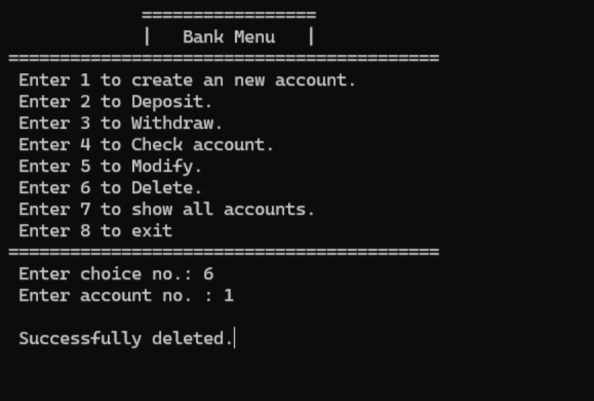
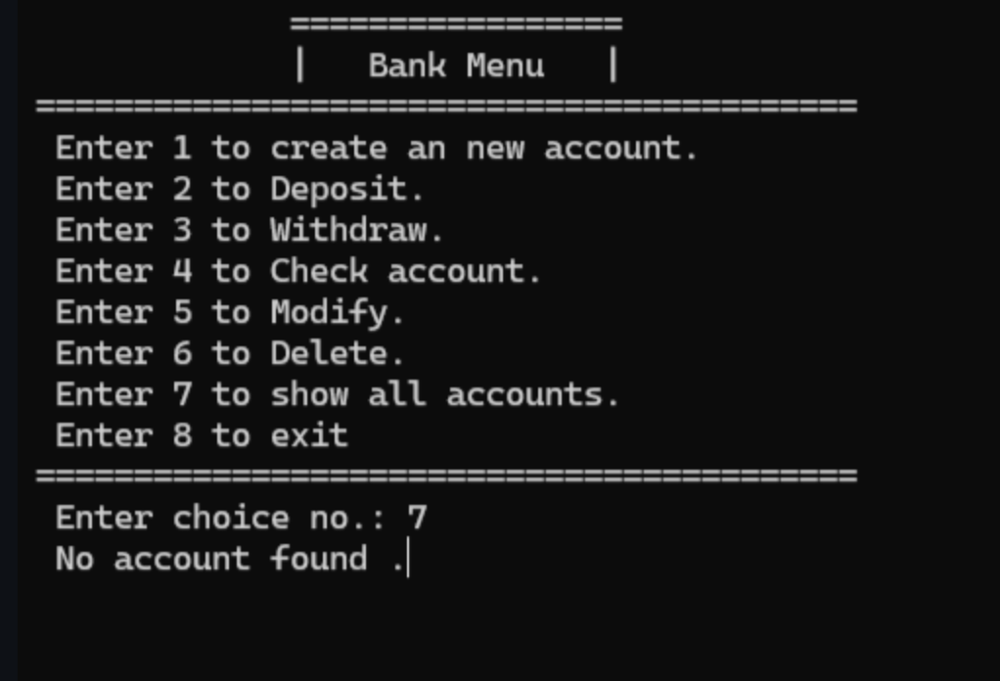

# Bank-Management-System-Cpp

### A simple Bank Management System in C++. It allows users to perform various operations such as:
-  Creating a new account,
-  Depositing money,
-  Withdrawing money,
-  Checking account details,
-  Modifying account information,
-  Viewing all existing accounts &
-  Deleting an account.

## Output:

### 1. Creating a new account:

### 2. Depositing money:

### 3. Withdrawing money:

### 4. Checking account details:

### 5. Modifying existing account:

### 6. Viewing all existing accounts:

### 7. Deleting account:

## Contributors:
-  Kemsarapu Anil - anilkemsarapu (https://github.com/anilkemsarapu)
